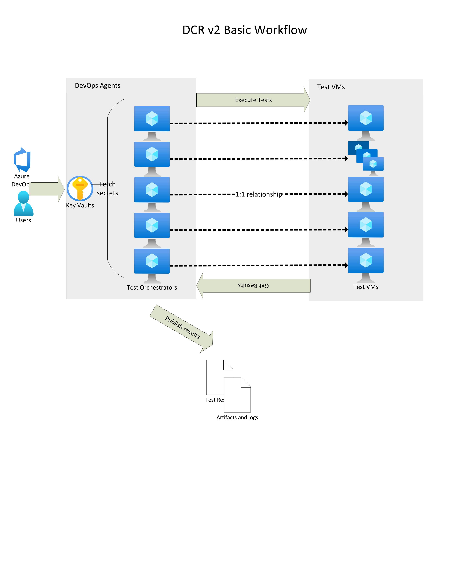
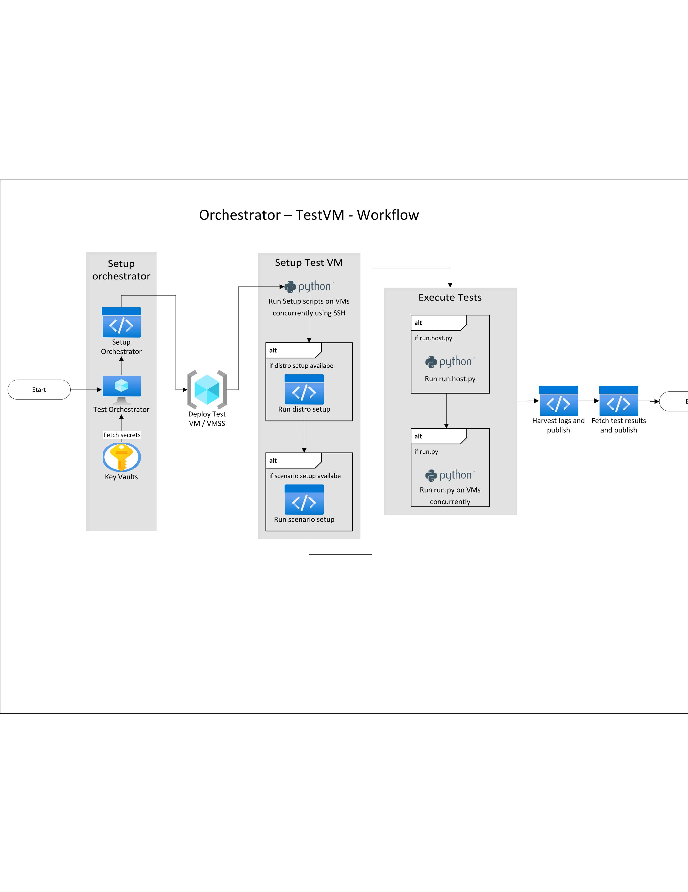

# DCR v2 - Azure Pipelines

## Introduction

This is the testing pipeline for the Linux Guest Agent. It uses [Azure Pipelines](https://docs.microsoft.com/en-us/azure/devops/pipelines/get-started/what-is-azure-pipelines?view=azure-devops) for its orchestration. Here's the link 
of the pipeline - https://dev.azure.com/cplatruntime/WALinuxAgent/_build?definitionId=1
  // To-Do: Update link with the final pipeline

## Architecture

A rough outline of the workflow is defined below.
- The entry way into the pipeline is - `dcr/azure-pipelines.yml`
- When a run is initiated, a DevOps agent on a fresh VM is assigned to the run from the Azure Pipelines hosted pool (image: `ubuntu-latest`). This is the orchestrator VM.

### Orchestrator Setup
- We set up the orchestrator VM for the test runs 
  - Setup SSH keys on the orchestrator. We use the same keys to deploy the test VMs later so that the orchestrator always has access to the test VMs.  
  - Pin to Python 3.7 and install pip dependencies
  - Download pypy3.7 for the test VM 
  - Overwrite the default settings of the run if a `config.json` file exists in the executing scenario.
  - Downloads all secrets from Key-Vault that are needed to deploy ARM template and use `az-cli` to initiate extension/VM related APIs (These secrets are only available scoped till the orchestrator and not passed to the test VM to avoid any cred leaks)

### Test-VM/VMSS Setup
- After setup, we deploy the Test-VM/VMSS as per the requested Distro.
- Once the VM is deployed, we set up the test VM and prepare it for the tests - 
  - Copy over all files (agent + DCR related) to the test VM.
  - The agent that is copied over is placed in the `/var/lib/waagent` directory and the agent is restarted to force it to pick up the testing agent. 
   > We don't install agent from source.
  - (We copy the whole `dcr` directory over to the test VM. To make the abstractions easier, a new directory `dcr/scenario/` is created on the test VM and the contents of the executing scenario are copied over there. This negates the need to maintain a name-specific path if needed in the tests).
  - In the case of a VMSS, we set up each instance separately. 
    - Using `asyncio`, we execute the setup commands simultaneously on each instance of the VMSS using SSH and wait for them to complete. 
    - If even a single instance fails to set up properly, we fail the whole step.
    - The recommended way for setting up a Scale Set is to either use a custom image or CSE extension. Since we didn't want to rely on either of those methods, we chose this approach of setting up the instances separately.
  - Install test dependencies on the Test VM (pip requirements, etc)
  - Run scenario specific `setup.sh` (if applicable)
  - Run distro specific setup scripts (if applicable)

### Execute tests

- Finally, after the setup is complete, we execute the tests (`run.host.py` or `run.py`)
  - If both files are present in the scenario directory, we execute `run.host.py` first and then `run.py` in that order.
  - If none of these files are present, then **no scripts would be executed for that scenario**.
  > Note: run.py is executed on the VM using pypy3.7 and not the system python interpreter.

### Fetch and Publish test results and artifacts 

- Once the tests are executed, we capture the `harvest` logs from the test VMs
- We collect the results from either `os.environ['BUILD_ARTIFACTSTAGINGDIRECTORY’]` directory in case of orchestrator VM or the `/home/{admin_username}` (or `~`) directory in case of the test VM.
- After collecting both data, we publish them separately per run to be visible on the UI.
  

## Key-points of DCR v2 - 

- Uses PyPy3.7 for executing python scripts on the Test VMs, alleviating the need to write cross-version compatible code
- For more ease of authoring scripts, pinned the orchestrator python version to py3.7 for parity
- Supports Mooncake and Fairfax 
- Sets up the test VM by setting up the new agent as auto-update rather than installing from source (as that’s distro
  dependent), making this less susceptible to set up failures
- Parameterized inputs, makes it easier to test specific scenarios and distros if needed. Easier to onboard new distros
  too
- Easy to author as its simple python scripts
- (M * N) test VMs are created per run, where M being the number of scenarios and N being the number of Distros
- There's a 1:1 relation between the Azure Pipeline agent VM and the test VM. This is to reduce the setup scripts we need to maintain on our end and to utilize Azure Pipelines to the fullest.
- This framework supports both VMs and VMSS deployments and can handle concurrently executing scripts for their setups.

## Author a Test

### Add a test
- To add a new scenario to the daily runs, simply add a new directory to the `dcr/scenarios` directory and add the scenario name to `scenarios` parameter in `dcr/azure-pipelines.yml` file
- Each file inside the scenario directory is confined to that scenario. To share code between scenarios, add the code in `dcr/scenario_utils` directory.
- Can specify `setup.sh` to run any scenario specific setup on the test VM –  
Eg: set up a cron job for firewall testing
- Can specify a `config.json` file to override default parameters of the test –  
Eg: set VM location to a specific region

### Executing the test scripts
There are 2 entry points into the test pipeline – **_run.host.py_** and _**run.py**_
  - #### run.host.py 
    - Run the script on the Orchestrator VM
    - Useful for running scenarios that require controlling the test VM externally
    - Eg: Using Az-cli for adding extensions, restarting VMs, etc
    - Drop off the result Junit XML file to `os.environ['BUILD_ARTIFACTSTAGINGDIRECTORY’]` directory
    > This is the only script that has access to the KeyVault secrets. The other method does not have that. 
    
    - #### run.py
    - Executed via SSH on the test VM
    - Can run anything, the only requirement is to drop off test result Junit XML file with to the home directory - `~
      /test-result-pf-run.xml`
    
### Publishing test results
- The test framework expects the test results to be in a JUnit XML file. If no file is produced by the test script, then no test results would be published in the pipeline.
- Depending on the type of test script (orchestrator VM vs the test VM), the JUnit file needs to be dropped off in a specific location.
- In addition to the directory location, the result file must conform to this naming convention - `test-result*.xml`  
Eg: `test-results-bvt-host.xml` or `test-results-ext-seq-run1.xml`
- The framework will automatically fetch all the test files from both the locations and aggregate them into one single file for better readability in the UI.
- The test results would be visible from the `Tests` tab under the summary UI.

## Troubleshooting failures
- The current implementation provides multiple helper utility tools to ease the process of authoring tests with enough retries and logging.
- In case of a test failure, the best place would be to start at the `Test UI` page as that would give you the exact failures with a stack trace of the failure.
- If that's not enough, you can go into the `summary` page of the run and check the console output at the task level.  
> Tip: The logger implemented in the code logs to the console too in the format it expects to make it more readable from the console output itself.
- Additionally, the `harvest logs` captures all relevant data from the TestVM before deleting it. That can be referred to too if the failure is coming from within the test VM itself.
- Currently, the logs are not written to a file, but can be added later if needed.

## Nomenclature

Here's a list of certain terminologies used widely in the repo

| Name          | Meaning       | 
| ------------- |:-------------:| 
| Scenarios      | The test directories used to add new test cases to the pipeline. Each directory under dcr/scenarios represents a test scenario that would be tested on the test VM | 
| Test Orchestrator     | The VM created by Azure Pipelines that hosts the tests for a specific scenario and a distro        | 
| Test VM | The VM created by the pipeline to run the tests. This is where we actually test out the scripts.      |
| Scenario Utils | Directory where all common code is placed      |
| Harvest logs | All the logs from the test VM. Useful for debugging VM related issues      |
| [YML/YAML](https://docs.microsoft.com/en-us/azure/devops/pipelines/get-started/yaml-pipeline-editor?view=azure-devops) | The file format in which the azure pipeline is defined     |
| [Azure Pipelines](https://docs.microsoft.com/en-us/azure/devops/pipelines/get-started/what-is-azure-pipelines?view=azure-devops) | CI/CD tool that we utilize for our DCR testing      |
| JUnit XML | Standard for the test results file that we use to publish our test results       |
| [Jobs](https://docs.microsoft.com/en-us/azure/devops/pipelines/process/phases?view=azure-devops&tabs=yaml) | A job is a series of steps that run sequentially as a unit. In other words, a job is the smallest unit of work that can be scheduled to run.      |
| [Tasks](https://docs.microsoft.com/en-us/azure/devops/pipelines/get-started/key-pipelines-concepts?view=azure-devops#task) | A task is the building block for defining automation in a pipeline. A task is packaged script or procedure that has been abstracted with a set of inputs.      |
| [Steps](https://docs.microsoft.com/en-us/azure/devops/pipelines/get-started/key-pipelines-concepts?view=azure-devops#step) | A step is the smallest building block of a pipeline.     |

